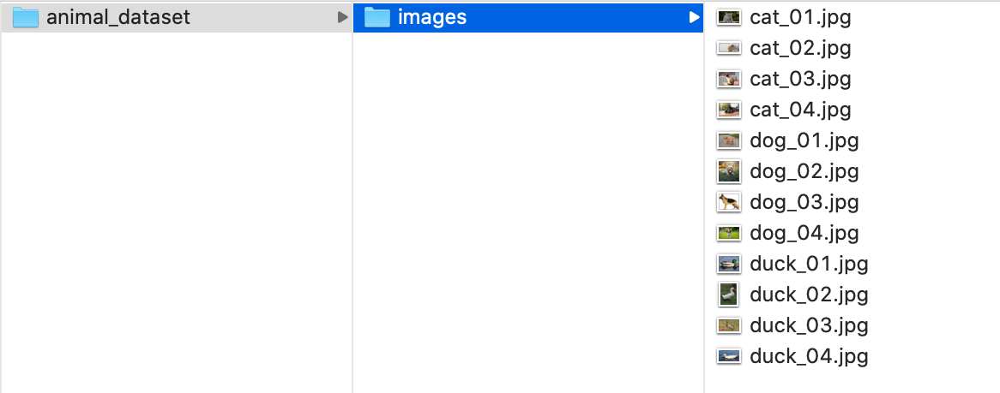
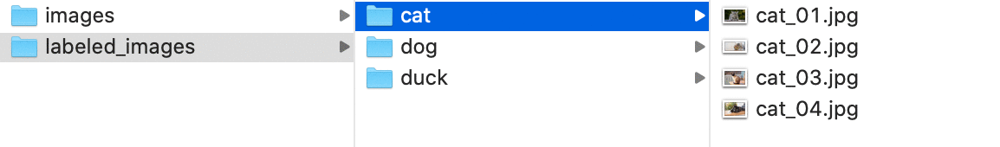

# Image Classification Labeling Tool

This tool is useful for preparing an image dataset for a classification task - it can speed up the labeling process. It 
shows all images in a folder and according to the key that the user presses, it copies or moves the image to another 
folder. In the end, all images will be separated in folders by classes. 

**Note:** this tool does not support multi-classes.

### Usage

We provide a ```requirements.txt``` file with the required Python packages to run this tool. This program can be run 
from the command line, providing the following arguments

* **image_folder:** path to the folder containing the images to be labeled.

* **output_folder**: path to the parent directory that will store the labeled dataset. Images will be separated by 
classes.

* **folder_names**: list of names of the folders corresponding to the classes (one for each class).

* **keys:** list containing the keys that the user will press to label images (one for each class). The i-th key 
corresponds to the i-th label in ```folder_names```.

* **delete**: flag indicating whether or not to delete original images. Its default value is *False*.

* **screen_factor**: percentage of the screen occupied by images that are too big. The default value is 0.9.


### Example

Suppose we have a small dataset of 4 cat, 4 dog and 4 duck images. They are all in the ```animal_dataset/images``` 
folder. Below we show our image dataset folder structure.



Now we want to manually label these images and store them in ```animal_dataset/labeled_images```. We will use 
the ```c``` key for the *cat* class, the ```d``` for the *dog*, and lastly, the ```u``` for the *duck*. To label the 
dataset, run the following command from this project's folder.

```
python label_images.py --image_folder ../animal_dataset/images \
                       --output_folder ../animal_dataset/labeled_images \
                       --folder_names cat dog duck \
                       --keys c d u
```

Each image will be shown to the user and, after he types the key that corresponds to that image's class, the next image 
is shown, and so on. In the end, all images will be separated by classes, as illustrated below.




